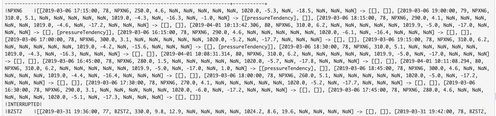
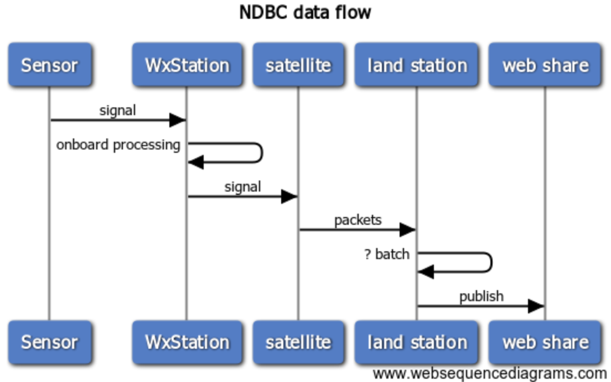

# sensor-failure

Anomaly detection in large sensor networks using Spark Arbitrary Stateful Streaming.

This implementation saves off a small trailing data set for each sensor interrupt.



The design applies to many IoT use cases.

#### Background

[NOAA](https://www.noaa.gov/) manages a world-wide network of weather stations under auspices of the [National Data Buoy Center](https://www.ndbc.noaa.gov/). 

Stations are land-based, moored, and floating.


Stations supply near-surface and underwater sensor arrays and report at fixed intervals or continuously. 

Data are transmitted via [GOES](https://en.wikipedia.org/wiki/Geostationary_Operational_Environmental_Satellite) or [Iridium](https://en.wikipedia.org/wiki/Iridium_satellite_constellation) satellite networks to a ground facility in Wallops Island, Virginia. Feeds are aggregated hourly and published to a publicly-accessible web-share location.



Where possible, NDBC supplements with feeds from assets outside of its direct jurisdiction, including ship observations.

#### Results

TODO

#### Architecture

TODO 

#### Nuts & Bolts

TODO 

#### Howto

#####  download buoy data 

```bash 
# from within `BASEDIR`...
% mkdir data && cd data ;
% wget -r -np -R "index.html*" https://www.ndbc.noaa.gov/data/realtime2/ ; 

# wait...

```

We have data from ~950 WxStations reporting ~17 different output formats. 

```bash
# Adcp files 29
# Adcp2 files 39
# Cwind files 75
# Dart files 45
# DataSpec files 152
# Drift files 8
# Hkp files 2
# Ocean files 178
# Rain files 36
# Spec files 312
# Srad files 17
# Supl files 65
# Swdir files 149
# Swr1 files 149
# Swr2 files 149
# Text files 799
```

##### Pre-requisites

- Apache Kafka (2.12-2.1.1 or similar)
- Apache Spark (2.4.0-bin-hadoop-2.7 or similar)
- sbt (1.2.7 or similar)
- scala (2.11.12 or similar)
- Redis (run via Docker - below)

##### Clone & Build

```bash

% git clone https://github.com/jasonnerothin/sensor-failure.git
% cd sensor-failure 
```
- edit [application.properties](src/main/resources/application.properties)
```bash
% sbt assembly

...

[info] Packaging /Users/jason/scratch/sensor-failure/target/scala-2.11/sensorfailure-assembly-1.0.jar ...
[info] Done packaging.
[success] Total time: 31 s, completed Apr 1, 2019 4:05:45 PM
[IJ]sbt:sensorfailure> 

```

##### Kafka & Redis

- Run Redis (on Docker)
````bash
# FROM `BASEDIR`...
cd bash
./start-redis.sh
````
- run [InitRedisImpl](src/main/scala/com/ubiquibit/buoy/jobs/setup/InitKafka.scala) 

- Install and start Kafka 

```bash 
# edit, then run...
./start-kafka.sh
./create-kafka-topics.sh

# wait...
```

- run [InitKafkaImpl](src/main/scala/com/ubiquibit/buoy/jobs/setup/InitKafka.scala) 

> It loads one (text) data feed per run from filesystem - recommend 3-4 runs for simple setup.

```bash

# before

./redis-login.sh

...

redis:6379> hmget "stationId:46082" "TXT"
1) "DOWNLOADED"

# Loads hard-coded Station 46082...

${SPARK_HOME}/bin/spark-submit --class "com.ubiquibit.buoy.jobs.setup.InitKafkaImpl" --master "spark://${SPARK_HOST}:7077" --deploy-mode cluster --executor-cores 2 --packages "org.apache.spark:spark-sql-kafka-0-10_2.11:2.4.0" "/Users/jason/scratch/sensor-failure/target/scala-2.11/sensorfailure-assembly-1.0.jar"
19/04/02 09:06:23 WARN NativeCodeLoader: Unable to load native-hadoop library for your platform... using builtin-java classes where applicable

# OR loads a station of your choosing...

${SPARK_HOME}/bin/spark-submit --class "com.ubiquibit.buoy.jobs.setup.InitKafkaImpl" --master "spark://${SPARK_HOST}:7077" --deploy-mode cluster --executor-cores 2 --packages "org.apache.spark:spark-sql-kafka-0-10_2.11:2.4.0" "/Users/jason/scratch/sensor-failure/Target/scala-2.11/sensorfailure-assembly-1.0.jar" "BZST2"

# after

./redis-login.sh

...

redis:6379> hmget "stationId:46082" "TXT"
1) "KAFKALOADED"
```

##### Init WxStream

- run [StageFeeds](src/main/scala/com/ubiquibit/buoy/jobs/util/StageFeeds.scala)

> It writes a file to the staging directory that will later be used by [WxStream](src/main/scala/com/ubiquibit/buoy/jobs/WxStream.scala)

##### Run WxStream

```bash
${SPARK_HOME}/bin/spark-submit --class "com.ubiquibit.buoy.jobs.WxStream" --master "spark://${SPARK_HOST}:7077" --deploy-mode cluster --executor-cores 4 --packages "org.apache.spark:spark-sql-kafka-0-10_2.11:2.4.0" "/Users/jason/scratch/sensor-failure/target/scala-2.11/sensorfailure-assembly-1.0.jar"
``` 

> check the driver's stdout log and [SparkUI](http://localhost:8080)

Note: WxStream console output shows up in the *driver* stdout. StationInterrupt and other debug logging shows up in the *application* stderr (if configured in `$SPARK_HOME/conf/log4.properties`)
